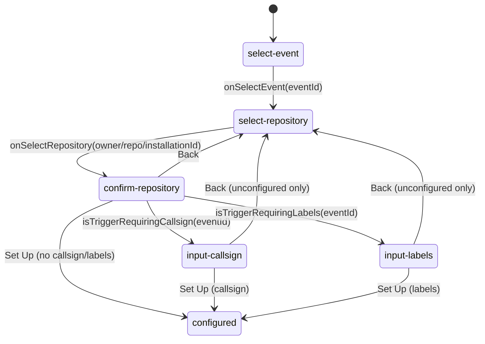
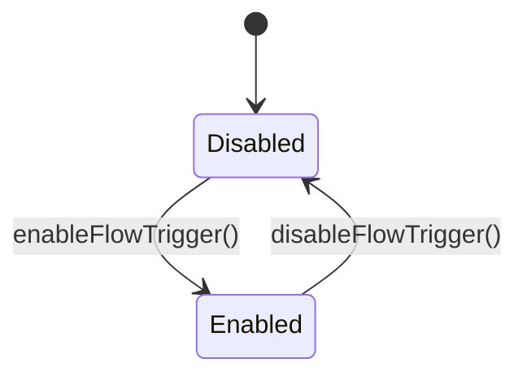
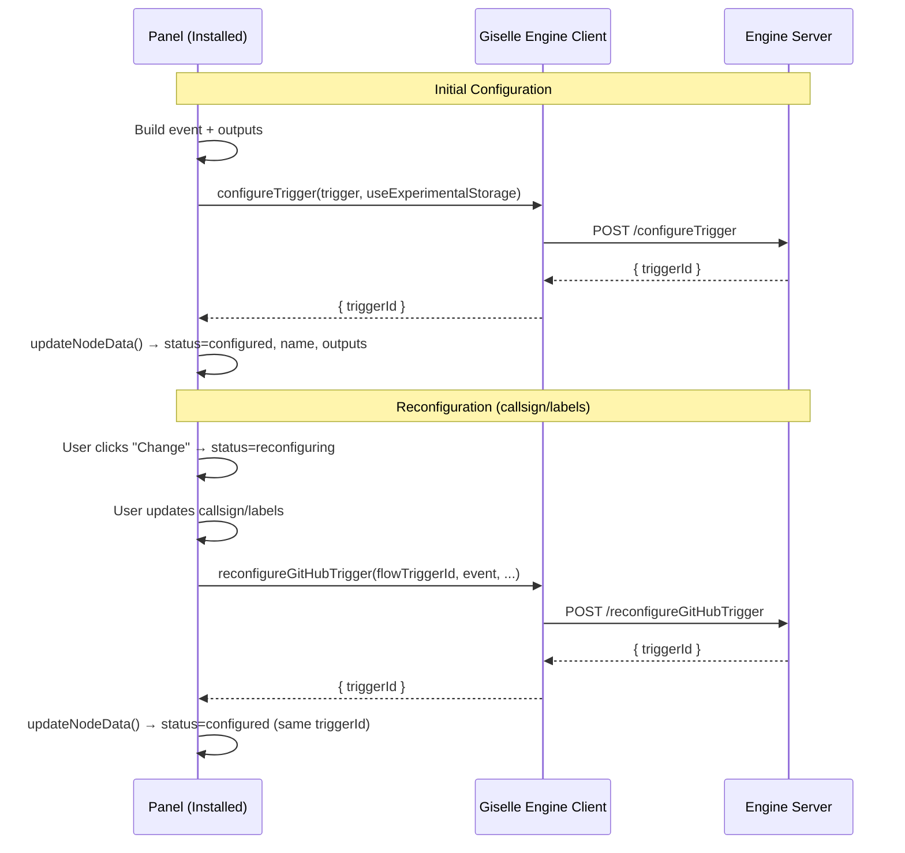

# GitHub Trigger Properties Panel — State Model (for Agents)

- Target file: `github-trigger-properties-panel.tsx`
- Location: `internal-packages/workflow-designer-ui/src/editor/properties-panel/trigger-node-properties-panel/providers/github-trigger/`
- Purpose: Capture the user-visible states, transitions, and underlying actions to help agents reason about edits and tests.

## States

- Node state:
  - `configured`: Setup completed with `flowTriggerId`. Properties panel shows `GitHubTriggerConfiguredView`.
  - `reconfiguring`: User initiated reconfiguration from configured view. Properties panel shows `GitHubTriggerReconfiguringView`.
  - `unconfigured` (implicit): Setup not yet completed. Properties panel drives setup.
  - Enable toggle: `enable: true|false` (controlled via `useGitHubTrigger` in configured view).
- Integration state (`useIntegration().value.github.status`):
  - `unset` | `unauthorized` | `not-installed` | `invalid-credential` | `installed` | `error`.
- Setup wizard state (`step.state`):
  - `select-event` → `select-repository` → `confirm-repository` → `input-callsign` (only for callsign events) → `input-labels` (only for label events) → configured.
- Reconfigure mode (`reconfigureModeRef.current`):
  - `repository` | `callsign` | `labels` (determines which step to start from in reconfiguring flow).

### Events requiring callsign
- `github.issue_comment.created`
- `github.pull_request_comment.created`
- `github.pull_request_review_comment.created`
- `github.discussion_comment.created`

### Events requiring labels
- `github.issue.labeled`
- `github.pull_request.labeled`

## High-level Flow

```mermaid
flowchart TD
  Start([Open Properties Panel]) --> CheckState{Node state}
  CheckState -- configured --> ConfiguredView[Show Configured View\n(GitHubTriggerConfiguredView)]
  CheckState -- reconfiguring --> ReconfiguringView[Show Reconfiguring View\n(GitHubTriggerReconfiguringView)]
  CheckState -- unconfigured --> CheckIntegration{Integration github.status}

  subgraph Integration
    CheckIntegration -- unauthorized --> Unauthorized["Unauthorized UI\n(Continue with GitHub)"]
    CheckIntegration -- not-installed --> NotInstalled["Install App UI\n(Install)"]
    CheckIntegration -- installed --> Wizard[Start Setup Wizard]
    CheckIntegration -- invalid-credential --> InvalidCred[Show invalid-credential]
    CheckIntegration -- error --> Err[Show error message]
    CheckIntegration -- unset --> Unset[Show unset]

    Unauthorized -- postMessage: github-app-installed --> Wizard
    NotInstalled -- postMessage: github-app-installed --> Wizard
  end
```

Notes:
- `Unauthorized` and `NotInstalled` use a popup and listen for `window.postMessage({ type: 'github-app-installed' })`, then call `useIntegration().refresh()` to re-fetch status.

## Setup Wizard



Note: During reconfiguration, the "Back" button is hidden in `input-callsign` and `input-labels` steps to simplify the UX.

On "Set Up":
- Build `GitHubFlowTriggerEvent` (with callsign or labels if needed).
- Derive `outputs` from `githubTriggers[eventId].event.payloads.keyof().options`.
- RPC `client.configureTrigger({ trigger: { nodeId, workspaceId, enable: false, configuration: { provider: 'github', repositoryNodeId, installationId, event } }, useExperimentalStorage })`.
- On success: update node data to `configured`, add generated `outputs`, and set name to `On ${trigger.event.label}`.

## Reconfiguration Flow

After a trigger is configured, users can reconfigure:
- **Repository**: Click "Change" in repository section → starts reconfiguration from `select-repository` step
- **Callsign**: Click "Change" in callsign section → starts reconfiguration from `input-callsign` step
- **Labels**: Click "Change" in labels section → starts reconfiguration from `input-labels` step

Reconfiguration behavior:
- Node state changes from `configured` to `reconfiguring` with existing `flowTriggerId`
- Panel shows `GitHubTriggerReconfiguringView` which renders the `Installed` component with appropriate `reconfigStep`
- Uses `client.reconfigureGitHubTrigger({ flowTriggerId, repositoryNodeId, installationId, event, useExperimentalStorage })`
- The `event` parameter can now include updated callsign or labels
- On success: node state returns to `configured` with the same `flowTriggerId`
- Duplicate labels are automatically filtered using `Set` during submission

## Runtime Enable/Disable



- Implemented via `useGitHubTrigger(flowTriggerId)`:
  - Fetches trigger via `getTrigger` and repository fullname for display.
  - Exposes `enableFlowTrigger` / `disableFlowTrigger` which patch `enable` with optimistic updates.

## Code Map (quick references)

- Panel entry and integration branching: `GitHubTriggerPropertiesPanel`.
- Installed flow + wizard host: `Installed` component (in the same file).
- Integration UI states:
  - Unauthorized: `components/unauthorized.tsx` (postMessage → `refresh()`).
  - Not installed: `components/install-application.tsx` (postMessage → `refresh()`).
- Wizard steps:
  - Event selection: `components/event-selection-step.tsx`.
  - Event type display: `components/event-type-display.tsx`.
  - Repository display: `components/repository-display.tsx`.
  - Callsign form: inline in `Installed` under `input-callsign`.
  - Labels form: `components/labels-input-step.tsx` with `showBackButton` prop.
- Helpers:
  - Callsign-needed check: `isTriggerRequiringCallsign()` in panel file.
  - Labels-needed check: `isTriggerRequiringLabels()` in panel file.
  - Event builder: `createTriggerEvent()` in `./utils/trigger-configuration`.
  - State tracking: `isReconfiguring` constant derived from `node.content.state.status`.
- Post-setup configured view: `../../ui/configured-views` → `GitHubTriggerConfiguredView`.
- Reconfiguring view: `../../ui/reconfiguring-views` → `GitHubTriggerReconfiguringView`.
- Node badge (enabled/disabled): `node/ui/github-trigger/status-badge.tsx` using `useGitHubTrigger`.

## Acceptance Hints (for testing)

- Integration states render the expected UI and recover after postMessage → `refresh()`.
- Non-callsign/non-label events skip those steps and reach `configured` after one confirm.
- Callsign events require a non-empty callsign; empty should not proceed.
- Label events require at least one non-empty label; empty should show error.
- Duplicate labels are automatically removed during submission.
- After setup, node name becomes `On ${label}` and outputs list matches event payload keys.
- Enabling/disabling reflects in status badge without full reload (optimistic UI).
- Reconfiguration flow:
  - Clicking "Change" on repository/callsign/labels enters `reconfiguring` state
  - During reconfiguration, "Back" button is hidden in callsign/labels steps
  - Successfully updating returns to `configured` state with same `flowTriggerId`
  - All state updates are wrapped in `startTransition` for consistent UI behavior



---

If you update the wizard or integration flow, please also update:
- The state lists above
- The Mermaid diagrams
- The acceptance hints
