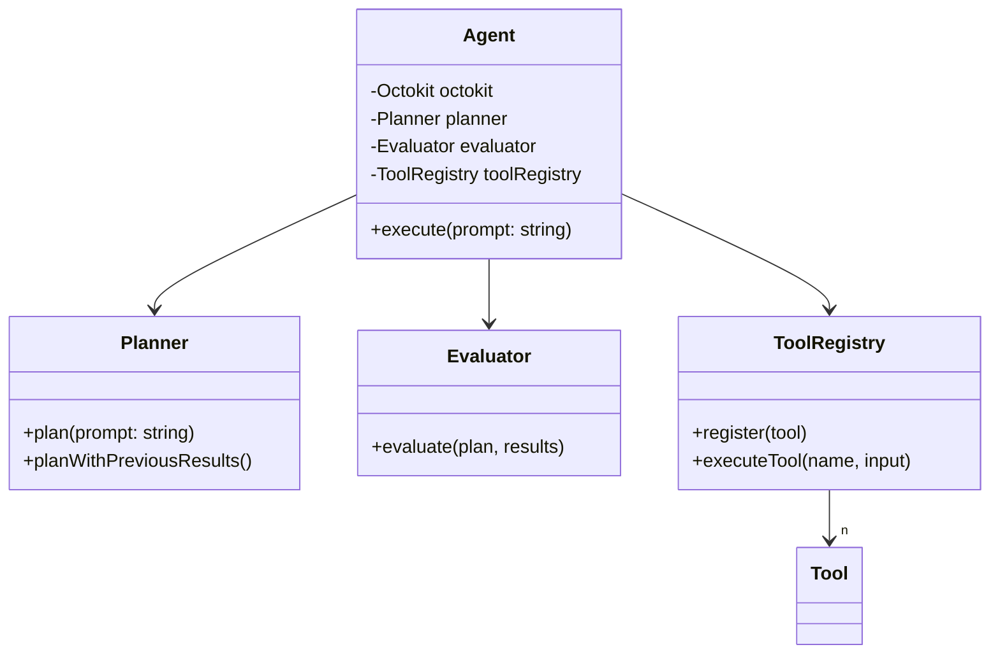
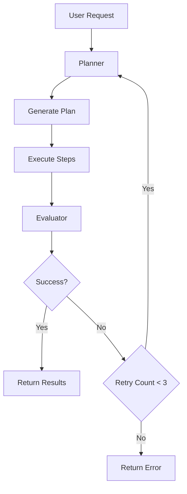

# GitHub Agent

An agent for retrieving information from GitHub repositories using the GitHub
API. Built with Node.js and TypeScript.

## Requirements

- Node.js 22.x or later
- GitHub Token (PAT, GitHub App, GitHub App Installation)
- OpenAI API Key

## Installation

```bash
npm install
```

## Environment Variables

Create a `.env` file in the root directory with the following variables:

```bash
GITHUB_TOKEN=your_github_token
OPENAI_API_KEY=your_openai_api_key
DEBUG=1  # Optional: Enable debug mode
```

## Usage

```typescript
import { Agent } from "github-agent";

const agent = new Agent(process.env.GITHUB_TOKEN);

// Execute a request
const result = await agent.execute("your request here");
```

Or use the CLI:

```bash
npm run cli "your request here"
```

## Development

```bash
# Run in development mode with auto-reload
npm run cli

# Run tests
npm test

# Type checking
npm run check-types

# Build
npm run build
```

## Component Architecture



## Architecture

The project consists of the following components:

### Core Components

- **Agent**: Main agent class that handles user requests and manages execution
- **Planner**: Analyzes user requests and breaks them down into executable steps
- **Evaluator**: Evaluates execution results and determines success/failure
- **ToolRegistry**: Manages available GitHub API tools

### Execution Flow



1. Receive user request
2. Planner analyzes request and generates execution plan
3. Execute each step sequentially
4. Evaluator assesses results
5. Replan and retry if necessary
6. Return final results to user

## Adding New Tools

Tools can be added using the `defineTool` function. Each tool requires:

- `name`: Unique identifier for the tool
- `description`: Brief description of what the tool does
- `purpose`: The intended use case of the tool
- `inputSchema`: Zod schema defining the expected input
- `execute`: Async function that performs the actual API call
- `examples`: (Optional) Example usage and expected output
- `constraints`: (Optional) List of tool limitations

Example:

```typescript
export const myNewTool = defineTool({
  name: "my_tool",
  description: "Performs a specific GitHub API operation",
  purpose: "Used to accomplish X task",
  inputSchema: z.object({
    tool: z.literal("my_tool"),
    param1: z.string(),
    param2: z.number().optional(),
  }),
  execute: async (octokit: Octokit, input) => {
    const result = await octokit.request("GET /endpoint", {
      param1: input.param1,
      param2: input.param2,
    });
    return result;
  },
  examples: [{
    input: {
      tool: "my_tool",
      param1: "example",
    },
    output: {/* expected output */},
    description: "Example usage of my_tool",
  }],
  constraints: [
    "Rate limit: X requests per minute",
    "Other limitations...",
  ],
});
```

Register the tool in your application:

```typescript
const toolRegistry = new ToolRegistry(octokit);
toolRegistry.register(myNewTool);
```

## Supported GitHub APIs

### Search APIs

- `search_code`: Search for code
- `search_repositories`: Search for repositories
- `search_users`: Search for users
- `search_issues`: Search for issues and pull requests

### Read APIs

- `get_file_contents`: Retrieve file contents
- `get_issue`: Get specific issue details
- `list_issues`: List repository issues
- `list_commits`: Get commit history
- `get_pull_request_diff`: Get pull request differences

### Generic APIs

- GraphQL API: For complex queries and retrieving multiple resources
- REST API: For special media types and endpoints not covered by GraphQL

## Limitations

### General Limitations

- GitHub Personal Access Token required for authenticated API access
- Subject to GitHub API rate limits
- Appropriate permissions required for private repository access

### Functional Limitations

- Dependencies between steps are not currently supported
- Result count limitations (e.g., maximum 100 results per page for searches)
- Binary files are automatically base64 encoded
- Symbolic links return the content of their target

### Runtime Limitations

- Maximum of 3 retry attempts
- Large files (>1MB) may be truncated
- Long-running requests may timeout
