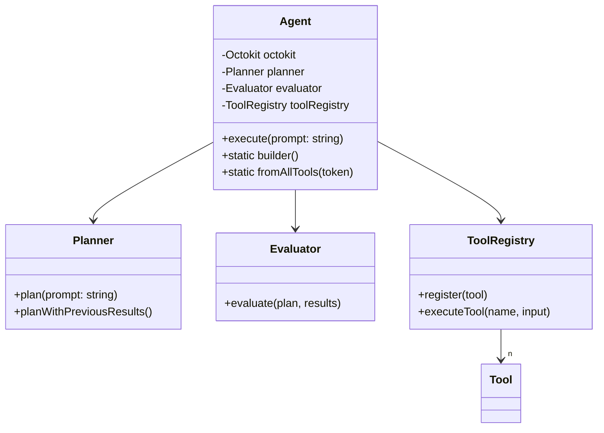
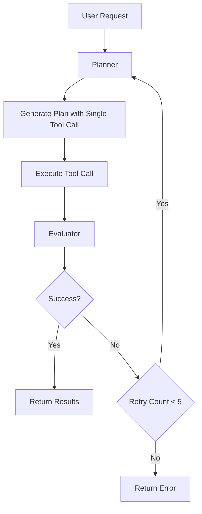

# GitHub Agent

An agent for retrieving information from GitHub repositories using the GitHub
API. Built with Node.js and TypeScript.

## Requirements

- Node.js 22.x or later
- GitHub Token (PAT, GitHub App, GitHub App Installation)
- OpenAI API Key

## Installation

```bash
npm install
```

## Environment Variables

Create a `.env` file in the root directory with the following variables:

```bash
GITHUB_TOKEN=your_github_token
OPENAI_API_KEY=your_openai_api_key
DEBUG=1  # Optional: Enable debug mode
```

## Usage

Basic usage:

```typescript
import { Agent } from "@giselles-ai/github-agent";

const agent = new Agent(process.env.GITHUB_TOKEN);

// Execute a request
const result = await agent.execute("your request here");
```

Using the builder pattern with specific tool groups:

```typescript
import { Agent, toolGroups } from "@giselles-ai/github-agent";

// Create an agent with only PR and issue tools
const agent = Agent.builder()
  .withToken(process.env.GITHUB_TOKEN)
  .withTools([
    ...toolGroups.pullRequests,
    ...toolGroups.issues,
  ])
  .build();

const result = await agent.execute("Get details of PR #123 in owner/repo");
```

Or use the CLI:

```bash
npm run cli "your request here"
```

## Development

```bash
# Run in development mode with auto-reload
npm run cli

# Run tests
npm test

# Type checking
npm run check-types

# Build
npm run build
```

## Component Architecture



## Architecture

The project consists of the following components:

### Core Components

- **Agent**: Main agent class that handles user requests and manages execution
- **Planner**: Analyzes user requests and breaks them down into executable steps
- **Evaluator**: Evaluates execution results and determines success/failure
- **ToolRegistry**: Manages available GitHub API tools

### Tool Groups

The tools are organized into logical groups:

- **issues**: Tools for managing issues
- **pullRequests**: Tools for working with pull requests
- **files**: Tools for file operations
- **search**: Tools for searching code, repositories, users, etc.
- **repos**: Tools for repository management
- **utils**: Advanced utility tools like GraphQL and REST

### Execution Flow



1. Receive user request
2. Planner analyzes request and selects appropriate tool
3. Execute single tool call
4. Evaluator assesses results
5. Replan and retry if necessary
6. Return final results to user

## Adding New Tools

Tools can be added using the `defineTool` function. Each tool requires:

- `name`: Unique identifier for the tool
- `description`: Brief description of what the tool does
- `purpose`: The intended use case of the tool
- `inputSchema`: Zod schema defining the expected input
- `execute`: Async function that performs the actual API call
- `constraints`: (Optional) List of tool limitations

Example:

```typescript
export const myNewTool = defineTool({
  name: "my_tool",
  description: "Performs a specific GitHub API operation",
  purpose: "Used to accomplish X task",
  inputSchema: z.object({
    tool: z.literal("my_tool"),
    param1: z.string(),
    param2: z.number().optional(),
  }),
  execute: async (octokit: Octokit, input) => {
    const result = await octokit.request("GET /endpoint", {
      param1: input.param1,
      param2: input.param2,
    });
    return result;
  },
  constraints: [
    "Rate limit: X requests per minute",
    "Other limitations...",
  ],
});
```

Register the tool in your application:

```typescript
// Using the builder pattern
const agent = Agent.builder()
  .withToken(process.env.GITHUB_TOKEN)
  .withTools([myNewTool, ...toolGroups.pullRequests])
  .build();
```

## Supported GitHub APIs

### Search APIs

- `search_code`: Search for code across GitHub repositories
- `search_repositories`: Search for repositories based on various criteria
- `search_users`: Search for users based on various criteria
- `search_issues`: Search for issues and pull requests across GitHub
  repositories

### Read APIs

- `get_file_contents`: Retrieve file or directory contents from a GitHub
  repository
- `get_issue`: Get specific issue details
- `list_issues`: List repository issues with filtering options
- `list_commits`: Get commit history of a repository branch

### Pull Request APIs

- `get_pull_request`: Get pull request details
- `list_pull_requests`: List repository pull requests
- `get_pull_request_diff`: Get pull request differences in unified diff format
- `get_pull_request_files`: Get files changed in a pull request
- `get_pull_request_status`: Get combined status of all status checks for a pull
  request
- `get_pull_request_comments`: Get review comments on a pull request
- `get_pull_request_reviews`: Get reviews on a pull request

### Generic APIs

- `rest`: Direct access to GitHub REST API endpoints with custom HTTP methods
  and parameters
- `graphql`: Execute GraphQL queries against GitHub's GraphQL API for efficient
  data retrieval

## Limitations

### General Limitations

- GitHub Personal Access Token required for authenticated API access
- Subject to GitHub API rate limits
- Appropriate permissions required for private repository access
- Read-only operations (no write operations are supported)

### Functional Limitations

- Dependencies between steps are not currently supported
- Result count limitations (e.g., maximum 100 results per page for searches)
- Binary files are automatically base64 encoded
- Symbolic links return the content of their target
- File search limited to 1000 files
- Code search limited to 384KB

### Runtime Limitations

- Maximum of 5 retry attempts
- Large files (>100MB) are not supported
- Long-running requests may timeout
